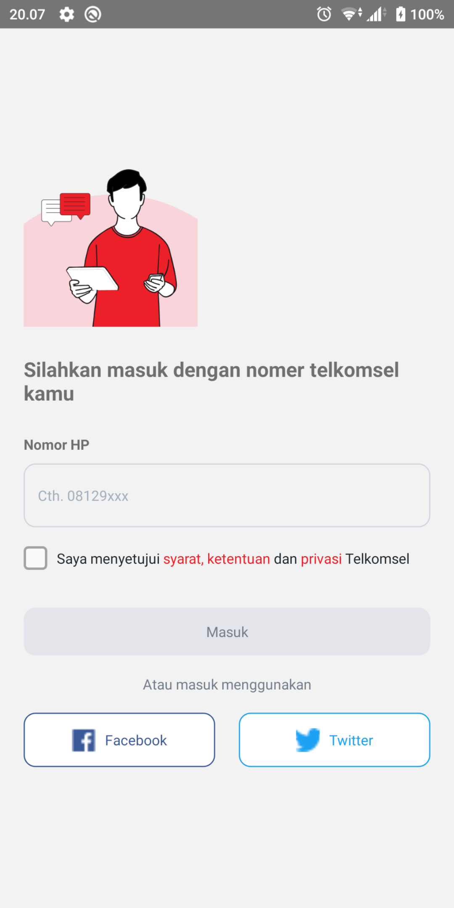
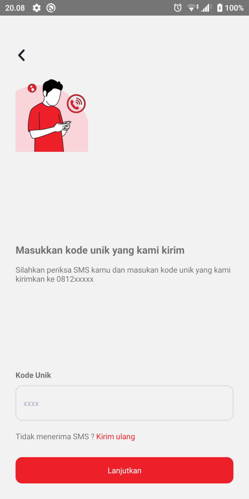
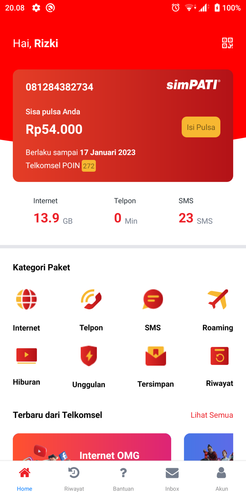

# React Native Clone MyTsel

## How to clone this project
Open website
```
https://download-directory.github.io/
```
copy url this project
```
https://github.com/kodinganstb/Android-IOS-ReactNative/tree/main/mini-projects/MyTsel
```
Enter

## How to install this project
```
cd yourDirectory
```
```
yarn install && yarn start
```
```
yarn android 
```
or
```
yarn ios
```

### for ios
```
cd ios
pod install
```
## Screenshot
<div style="display: flex; flex-direction: row; align-self: center; align-items: center">





</div>

